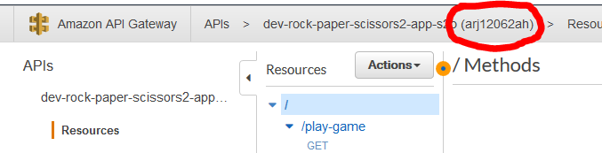

# Rock Paper Scissors

This is the code that have been used in the following presentations:

1. 2019-08-26 ["Melbourne AWS User Group Monthly Meetup"](https://www.meetup.com/en-AU/AWS-AUS/events/qgxqpqyzlblc/)
2. 2019-03-21 ["Real World Serverless: making and breaking, betting and banking"](https://www.meetup.com/en-AU/Perth-Serverless/events/259300664/)

## Elevator Pitch

> Cutting through the BS to seed, build, deploy and then crash a Serverless application in 30ish minutes or less (or your runtime is free). A live presentation in three parts where I will seed and deploy the CI/CD pipeline for a Serverless application. Next, I will deploy the application code and take it for a spin. Finally, I'll overload the API and see what's broken using AWS X-Ray.

## Taking it for a Spin!

If you've attended one of the above presentations and/or would like to try the code out, you "should" just need to do the following:

1. Clone this repository (and then delete the `.git` folder)
2. Perform a global search and replace on the following buckets (remember; all S3 bucket names have to be universally unique):

    | Value             | Description                                                                                     |
    | ----------------- | ----------------------------------------------------------------------------------------------- |
    | @@AwsCliProfile@@ | The AWS Profile to use for deploying this project                                               |
    | @@AwsRegion@@     | The AWS region you want deploy into                                                             |
    | @@bucket-prefix@@ | This is prefix used to name any S3 bucket that need to be created. This needs to be lower case. |
    | @@PipelineName@@  | This is prefix used to name any other resources that are created.                               |

3. Run the `init.sh` to deploy everything. This is based off of an ["Inception Pipeline"](https://mechanicalrock.github.io/2018/03/01/inception-pipelines-pt1)
4. Once everything is build and deployed, navigate into [API Gateway](https://@@AwsRegion@@.console.aws.amazon.com/apigateway/home?region=@@AwsRegion@@#/apis) and grab the API Id (the value circled in red) 
5. Replace the string 'zzzAPIIDzzz' with the API Id and open this in your browser: `https://zzzAPIIDzzz.execute-api.@@AwsRegion@@.amazonaws.com/dev/play-game?humanName=Pipeline%20Pete&humanChoice=ROCK`
6. Have fun!

## Potential Issues

### Issue #1

This project creates a [CodeCommit](https://aws.amazon.com/codecommit/) repository in your AWS Account. As part of executing the `init.sh` script, all the code will be pushed to this repository. To allow this you may need to add the following snippet to your `~/.gitconfig` file:

```properties
[credential "https://git-codecommit.@@AwsRegion@@.amazonaws.com/v1/repos/@@PipelineName@@"]
    helper = !aws --profile mr_sandbox_pete codecommit credential-helper $@
    UseHttpPath = true
```
